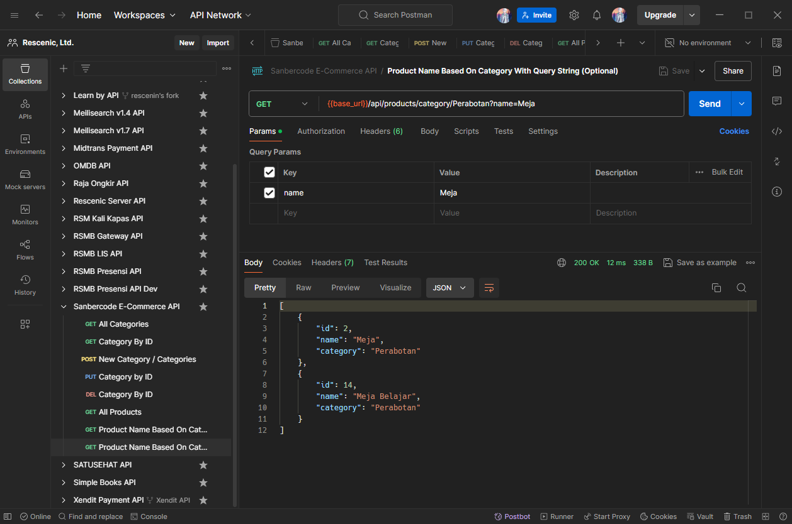

# Tugas 6 Sanbercode Node.JS Backend

## Muhammad Ridwan Hakim

### Deploy Localhost

```bash
git clone https://github.com/rescenic/nodejs-tugas6.git

cd nodejs-tugas6

npm install

npm start
or
npm run dev
```

### Import Sanbercode E-Commerce API.postman_collection.json to Postman

### Screenshots



### 🔖 API Documentation

#### 1\. GET /api/categories

- **Description**: Get all categories.

- **Response**: Array of category objects.

``` json
[  { "id": 1, "name": "Elektronik" },  { "id": 2, "name": "Perabotan" }]

 ```

#### 2\. GET /api/categories/:id

- **Description**: Get a category by ID.

- **Parameters**:

  - `id`: ID of the category.

- **Response**: Category object or 404 if not found.

``` json
{ "id": 1, "name": "Elektronik" }

 ```

#### 3\. POST /api/categories

- **Description**: Add a new category.

``` json
{ "name": "Pakaian" }

 ```

- **Response**: The newly created category object.

``` json
{ "id": 3, "name": "Pakaian" }

 ```

- **Description**: Add several categories at once.

``` json
[
  { "name": "Pakaian" },
  { "name": "Makanan" },
  { "name": "Olahraga" }
]

 ```

- **Response**: The newly created array of category objects.

``` json
[
    {
        "id": 3,
        "name": "Pakaian"
    },
    {
        "id": 4,
        "name": "Makanan"
    },
    {
        "id": 5,
        "name": "Olahraga"
    }
]

 ```

#### 4\. PUT /api/categories/:id

- **Description**: Update a category by ID.

- **Parameters**:

  - `id`: ID of the category.

``` json
{ "name": "Pakaian dan Aksesoris" }

 ```

- **Response**: The updated category object or 404 if not found ("Kategori tidak ditemukan.").

``` json
{ "id": 3, "name": "Pakaian dan Aksesoris" }

 ```

#### 5\. DELETE /api/categories/:id

- **Description**: Delete a category by ID.

- **Parameters**:

  - `id`: ID of the category.

- **Response**: 204 No Content.

#### 6\. GET /api/products

- **Description**: Get all products or search products by name.

- **Query Parameters**:

  - `name` (optional): Name to search products.

- **Response**: Array of product objects.

``` json
[ { "id": 1, "name": "Laptop", "category": "Elektronik" }, { "id": 2, "name": "Meja", "category": "Perabotan" }]

 ```

#### 7\. GET /api/products/category/:categoryName?name=:name

- **Description**: Get products by category and optional search by name.

- **Parameters**:

  - `categoryName`: Name of the category.

- **Query Parameters**:

  - `name` (optional): Name to search products.

- **Response**: Array of product objects.

``` json
[ { "id": 1, "name": "Laptop", "category": "Elektronik" }

 ```
